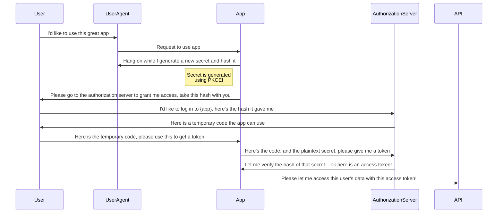

# OAuth and OpenID Connect

## Understanding the Differences Between OAuth and OpenID Connect

OAuth and OpenID Connect are distinct protocols with different purposes and security considerations. OAuth is designed primarily for applications to gain access to APIs without needing to know the user's identity. An analogy is provided comparing OAuth to checking into a hotel: the front desk (OAuth authorization server) verifies identity but gives a key card (access token) that allows access to various facilities without revealing who the guest is.

In contrast, OpenID Connect builds on OAuth by adding user identity information. It introduces ID tokens, which communicate user data back to applications, allowing them to identify users and display their information. In summary, OAuth focuses on API access, while OpenID Connect emphasizes user identification, with the key takeaway being to think of OAuth as related to accessing APIs and OpenID Connect as related to identifying users.

## Understanding OAuth Roles and Authorization Flow

### The Four Roles in OAuth

In a typical scenario where a user accesses data from an API, there are four primary roles:

1. **User**: The individual with the account.
2. **Device**: The user's mobile phone or web browser.
3. **Application**: The software running on the device, which interacts with the API.
4. **API**: The resource that contains the data the application requests.

### OAuth Terminology

The OAuth specification uses more precise terms:

- **Resource Owner**: Instead of "user."
- **User Agent**: Instead of "device."
- **OAuth Client**: Instead of "application."
- **Resource Server**: Instead of "API."

While these terms are technically accurate, they can be interchangeable in casual conversation.

### Confusion Around "Application

The term "application" can be ambiguous, as it may refer to both mobile apps and APIs. In the context of OAuth, it specifically denotes the OAuth Client that accesses data from the API.

### Limitations of Previous Authentication Methods

Earlier methods, like cookie-based authentication, involve the user typing their password into the device, which then communicates directly with the web application to obtain a session cookie. Although this is an improvement over storing passwords, there is still room for better security.

### The Role of the Authorization Server

OAuth was originally designed to allow third-party applications to access user data without sharing passwords. The introduction of the authorization server helps achieve this by:

- Allowing users to log in directly at the authorization server.
- Generating an access token to grant the application access to the API.

This process ensures that the application never sees the user's password.

### Access Token Validation

Once the application receives the access token, it can make requests to the API, which must validate the token. This approach is more secure than allowing APIs to validate passwords directly.

### OAuth Architecture Considerations

In OAuth, roles are not necessarily distinct components. For instance:

- A small system may have an API with a built-in OAuth server, meaning it serves both as the authorization and resource server.
- In more complex systems, you might have a separate authorization server and multiple microservices acting as resource servers.

## Overview of OAuth Client Types

In OAuth, the type of application plays a crucial role in determining various security properties associated with it. OAuth 2.0 classifies applications into two primary types: **Confidential Clients** and **Public Clients**. This classification is based on whether an application can securely store credentials, such as a client secret, during the OAuth exchange.

### Confidential Clients

Confidential clients can be securely deployed with a client secret, which remains hidden from users. These are typically server-side applications, developed using languages like Java, .NET, or PHP. Developers often store API keys in configuration files or environment variables to maintain their secrecy.

### Public Clients

Conversely, public clients, such as mobile apps or single-page applications (SPAs), cannot securely store secrets. Users can access the source code of SPAs through the browser, revealing any embedded secrets. Similarly, mobile apps can be reverse-engineered to extract sensitive information. Consequently, secrets should never be included in applications running on user-controlled devices.

### Importance in OAuth Communication

In OAuth, client authentication is critical as it ensures that only legitimate applications can communicate with the authorization server. When credentials are included in requests, the server can verify the application's identity, preventing impersonation. Authorization servers may enforce different policies based on the client type, influencing aspects like consent screens, refresh token issuance, and token lifetimes.

### Credentialed Clients in OAuth 2.1

OAuth 2.1 introduces a middle ground termed **Credentialed Clients**. These clients possess credentials but have not undergone identity verification by the authorization server. For instance, a mobile app may utilize dynamic client registration to obtain a client secret on its first launch without any initial authentication, allowing potential impersonation at that stage. However, subsequent requests can use the obtained client secret to authenticate the app.

## OAuth and User Consent

### Protecting User Data

OAuth aims to protect user data and ensure it is shared only with desired parties. The consent screen prompts users for permission before sharing their information during the authorization process.

### Importance of the Consent Screen

The consent screen is crucial for the authorization server to confirm that it is protecting the user effectively. Without it, users may unwittingly share their information with unauthorized apps.

### The Password Grant Flow

The password grant flow involves users providing their credentials directly to an application, which then sends them to the authorization server for an access token. This process is simplistic and lacks user verification.

### Risks of the Password Grant

There are significant risks associated with the password grant. Users may unknowingly hand over their credentials to third-party applications, creating security vulnerabilities. Even first-party apps may misuse this flow, as the authorization server cannot confirm if the user is actively logging in.

### Role of the Authorization Server

By redirecting users to the authorization server for authentication, users only enter their passwords on the server, ensuring they are actively using the application and agree to the access requested.

### Addressing Multifactor Authentication

The password grant flow is not conducive to integrating multifactor authentication (MFA). Redirecting users to the authorization server allows for easy implementation of MFA, enhancing overall security without altering application code.

### Skipping User Consent for First-Party Clients

For first-party confidential clients, user consent may be bypassed because the risk of app impersonation is minimized. However, the redirect remains essential for maintaining security benefits, including MFA.

## Front Channel vs. Back Channel in OAuth

### Introduction to Front Channel vs. Back Channel

- The front channel and back channel describe different methods of data transfer between systems.
- The back channel is a secure, client-to-server connection, typically over HTTPS, ensuring data integrity and authenticity.
- The front channel uses the browser's address bar to transfer data between systems.

### Back Channel: Secure Data Transfer

- In the back channel, the connection is encrypted, ensuring data cannot be tampered with.
- The back channel can be compared to hand-delivering a package, where both the sender and recipient are verified.

### Front Channel: Less Secure Data Transfer

- The front channel involves using a third-party, like a delivery service, to transfer data.
- This introduces issues of trust and verification, as you cannot guarantee the data's integrity during transit.
- Similarly, the recipient cannot be certain of the sender’s authenticity or whether the data was compromised.

### OAuth and Data Delivery

- In OAuth, the goal is for the application to securely obtain an access token.
- The back channel is ideal for secure delivery, but the front channel is used to ensure user consent.

### Why the Front Channel is Necessary in OAuth

- The front channel allows the user to be involved in the authorization process.
- It's also useful for incorporating multi-factor authentication, where the authorization server handles this aspect.

### OAuth Flow Design

- The application first sends a non-sensitive request to the authorization server via the front channel.
- After the user logs in and consents, the authorization server can send the user back to the application.

### Problems with Front Channel Token Delivery (Implicit Flow)

- Sending access tokens via the front channel is insecure and is no longer recommended.
- This method, known as the Implicit flow, is discouraged due to the lack of security.

### Back Channel Token Delivery and Modern Browsers

- Modern browsers support Cross-Origin Resource Sharing (CORS), enabling secure back channel communication.
- JavaScript apps can now use the back channel by making POST requests to the OAuth server, ensuring secure token delivery.

### Clarifying the Back Channel for JavaScript Apps

- The back channel refers to any client-to-server connection, including JavaScript making AJAX or Fetch requests.

## Application Identity in OAuth

### Application as an Entity

Applications, known as clients in OAuth, act as independent entities. They use a **client ID** to identify themselves in the OAuth flow, especially during the authorization process.

### Client ID and Client Secret

The **client ID** identifies an app, while the **client secret** is like an app's password. Public apps without a client secret can't guarantee their identity, which can create security risks if an attacker intercepts tokens.

### Authorization Code Flow

The flow begins with the app redirecting the user's browser to the authorization server, providing parameters like the **scope** and **redirect URI**. The server responds with an **authorization code**, which the app exchanges for an access token.

### PKCE (Proof Key for Code Exchange)

For apps without a client secret (e.g., mobile apps), **PKCE** is used. It allows the app to generate a unique secret for each request, ensuring that only the app that started the flow can redeem the authorization code.

### Redirect URI and Application Identity

The **redirect URI** is crucial for application identity, especially in mobile and single-page apps. Web apps use globally unique URLs, but mobile apps may use custom URL schemes, which are less reliable for identifying apps.

### Importance of HTTPS Redirect URIs

For security, HTTPS redirect URIs are more trusted because they require the app developer to prove domain ownership. This makes them a key part of app identity verification.

## Authorization Code Flow Overview

We will walk through the complete authorization code flow for web applications, using sample URLs and discussing differences that may arise with OAuth servers. At the end, there will be an opportunity to try the flow with a real OAuth server.

### Starting the Flow

Once an application is registered with an OAuth server and has a client ID and secret, the flow begins. The goal is to deliver an access token from the server to the application, ideally via the back channel, so the token stays out of the browser for enhanced security.

1. **Login Trigger**: The user clicks the login button to begin.
2. **PKCE Code Verifier**: The app generates a random secret (PKCE Code Verifier), hashes it to create a Code Challenge, and stores it. This hash is included in the redirect URL.
3. **Redirection to OAuth Server**: The user is redirected to the OAuth server with the Code Challenge, client ID, redirect URL, and scope.
4. **Authorization Request via Front Channel**: The request is sent via the browser, ensuring only the hash (not the secret) is transmitted for security reasons.

### User Authentication and Authorization

1. **User Authentication**: At the OAuth server, the user logs in, possibly performs multi-factor authentication, and confirms they want to log in to the app.
2. **Authorization Code Delivery**: The OAuth server sends the user back to the application with an authorization code via the browser (front channel).
3. **Authorization Code Validity**: The code is one-time use and must be redeemed quickly.

### Access Token Exchange via Back Channel

1. **Back Channel Request**: The application server exchanges the authorization code for an access token by sending a request to the OAuth server (bypassing the browser). The request includes the authorization code, client credentials, and the plaintext PKCE secret.
2. **Access Token Delivery**: The server validates the request, compares the hashes, and delivers the access token to the app for use in API requests.

### Security with PKCE

PKCE (Proof Key for Code Exchange) was initially designed for mobile apps but is now recommended for all types of applications, even those with client secrets, to prevent attacks like the authorization code injection attack.

### Step-by-Step Flow with Parameters

1. **Generate Code Verifier and Challenge**: The app generates a random string (code verifier) and hashes it using SHA256 to create the Code Challenge.
2. **Build Authorization URL**: Add parameters like `response_type=code`, client ID, redirect URL, scope, and Code Challenge to the authorization endpoint URL.
3. **User Authentication**: The user logs in and approves the request. If successful, the OAuth server returns the authorization code.
4. **Token Exchange**: The app exchanges the authorization code for an access token by making a back channel POST request to the token endpoint. The request includes the client credentials and Code Verifier.
5. **Access Token Usage**: The app uses the access token to make API requests. If a refresh token is received, it can be used to get a new access token when the current one expires.

### Handling Errors and Refresh Tokens

- Errors may occur during the token exchange, requiring the flow to restart.
- Refresh tokens may expire or fail due to various reasons (e.g., revoked permissions, deleted users).

### Best Practices and PKCE Adoption

PKCE is now part of OAuth 2.1 Security Best Practices and is recommended for all apps to defend against code injection attacks. While some servers may not support PKCE yet, it can still be implemented in your OAuth clients to future-proof the application.
