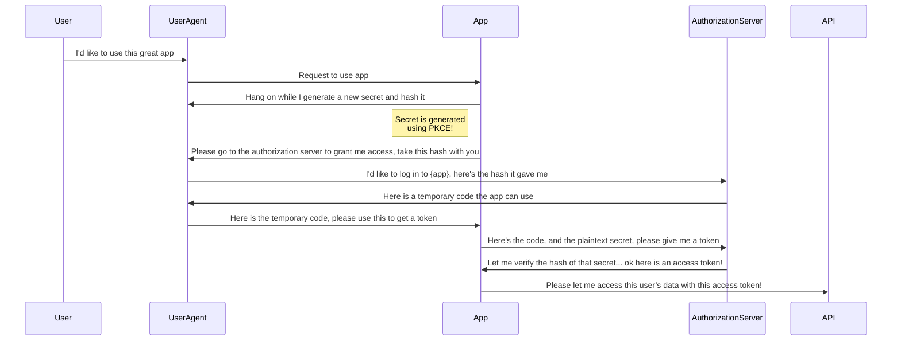
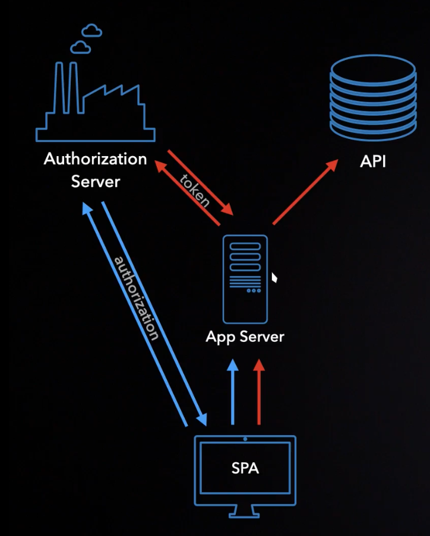

# OAuth and OpenID Connect

## Table of Content

- [OAuth and OpenID Connect](#oauth-and-openid-connect)
  - [Table of Content](#table-of-content)
  - [Understanding the Differences Between OAuth and OpenID Connect](#understanding-the-differences-between-oauth-and-openid-connect)
  - [Understanding OAuth Roles and Authorization Flow](#understanding-oauth-roles-and-authorization-flow)
    - [The Four Roles in OAuth](#the-four-roles-in-oauth)
    - [OAuth Terminology](#oauth-terminology)
    - [Confusion Around "Application](#confusion-around-application)
    - [Limitations of Previous Authentication Methods](#limitations-of-previous-authentication-methods)
    - [The Role of the Authorization Server](#the-role-of-the-authorization-server)
    - [Access Token Validation](#access-token-validation)
    - [OAuth Architecture Considerations](#oauth-architecture-considerations)
  - [Overview of OAuth Client Types](#overview-of-oauth-client-types)
    - [Confidential Clients](#confidential-clients)
    - [Public Clients](#public-clients)
    - [Importance in OAuth Communication](#importance-in-oauth-communication)
    - [Credentialed Clients in OAuth 2.1](#credentialed-clients-in-oauth-21)
  - [OAuth and User Consent](#oauth-and-user-consent)
    - [Protecting User Data](#protecting-user-data)
    - [Importance of the Consent Screen](#importance-of-the-consent-screen)
    - [The Password Grant Flow](#the-password-grant-flow)
    - [Risks of the Password Grant](#risks-of-the-password-grant)
    - [Role of the Authorization Server](#role-of-the-authorization-server)
    - [Addressing Multifactor Authentication](#addressing-multifactor-authentication)
    - [Skipping User Consent for First-Party Clients](#skipping-user-consent-for-first-party-clients)
  - [Front Channel vs. Back Channel in OAuth](#front-channel-vs-back-channel-in-oauth)
    - [Introduction to Front Channel vs. Back Channel](#introduction-to-front-channel-vs-back-channel)
    - [Back Channel: Secure Data Transfer](#back-channel-secure-data-transfer)
    - [Front Channel: Less Secure Data Transfer](#front-channel-less-secure-data-transfer)
    - [OAuth and Data Delivery](#oauth-and-data-delivery)
    - [Why the Front Channel is Necessary in OAuth](#why-the-front-channel-is-necessary-in-oauth)
    - [OAuth Flow Design](#oauth-flow-design)
    - [Problems with Front Channel Token Delivery (Implicit Flow)](#problems-with-front-channel-token-delivery-implicit-flow)
    - [Back Channel Token Delivery and Modern Browsers](#back-channel-token-delivery-and-modern-browsers)
    - [Clarifying the Back Channel for JavaScript Apps](#clarifying-the-back-channel-for-javascript-apps)
  - [Application Identity in OAuth](#application-identity-in-oauth)
    - [Application as an Entity](#application-as-an-entity)
    - [Client ID and Client Secret](#client-id-and-client-secret)
    - [Authorization Code Flow](#authorization-code-flow)
    - [PKCE (Proof Key for Code Exchange)](#pkce-proof-key-for-code-exchange)
    - [Redirect URI and Application Identity](#redirect-uri-and-application-identity)
    - [Importance of HTTPS Redirect URIs](#importance-of-https-redirect-uris)
  - [Authorization Code Flow Overview](#authorization-code-flow-overview)
    - [Starting the Flow](#starting-the-flow)
    - [User Authentication and Authorization](#user-authentication-and-authorization)
    - [Access Token Exchange via Back Channel](#access-token-exchange-via-back-channel)
    - [Security with PKCE](#security-with-pkce)
    - [Step-by-Step Flow with Parameters](#step-by-step-flow-with-parameters)
    - [Handling Errors and Refresh Tokens](#handling-errors-and-refresh-tokens)
    - [Best Practices and PKCE Adoption](#best-practices-and-pkce-adoption)
  - [Mobile Apps](#mobile-apps)
    - [Mobile Apps in OAuth Authorization](#mobile-apps-in-oauth-authorization)
      - [Client Secret Issues in Mobile Apps](#client-secret-issues-in-mobile-apps)
      - [Solution for Mobile Apps](#solution-for-mobile-apps)
    - [Redirect URLs in Mobile OAuth Flow](#redirect-urls-in-mobile-oauth-flow)
      - [Redirect URLs in Web Apps](#redirect-urls-in-web-apps)
      - [Challenges in Mobile Apps](#challenges-in-mobile-apps)
      - [Custom URL Schemes](#custom-url-schemes)
      - [Deep Linking (App-Claimed URL Patterns)](#deep-linking-app-claimed-url-patterns)
      - [Importance of PKCE](#importance-of-pkce)
    - [OAuth in Mobile Apps: Browser Launch](#oauth-in-mobile-apps-browser-launch)
      - [Early Mobile OAuth Flow Challenges](#early-mobile-oauth-flow-challenges)
      - [Use of Embedded Web Views](#use-of-embedded-web-views)
      - [Modern APIs for Secure OAuth Flow](#modern-apis-for-secure-oauth-flow)
    - [Authorization Code Flow for Native and Mobile Applications](#authorization-code-flow-for-native-and-mobile-applications)
      - [Native Apps and Client Secrets](#native-apps-and-client-secrets)
      - [Flow Overview](#flow-overview)
      - [Step-by-Step Process](#step-by-step-process)
      - [PKCE (Proof Key for Code Exchange)](#pkce-proof-key-for-code-exchange-1)
      - [Building the Request](#building-the-request)
      - [OAuth and Mobile Browsers](#oauth-and-mobile-browsers)
      - [Handling Errors and Success](#handling-errors-and-success)
      - [Final Exchange](#final-exchange)
    - [Overview of Using Refresh Tokens in Mobile Apps](#overview-of-using-refresh-tokens-in-mobile-apps)
      - [What Are Refresh Tokens?](#what-are-refresh-tokens)
      - [Why Are Refresh Tokens Important for Mobile Apps?](#why-are-refresh-tokens-important-for-mobile-apps)
      - [How to Request a Refresh Token](#how-to-request-a-refresh-token)
      - [Using the Refresh Token](#using-the-refresh-token)
      - [Security and Best Practices](#security-and-best-practices)
      - [Example Workflow](#example-workflow)
  - [Single-Page Apps (SPAs)](#single-page-apps-spas)
    - [OAuth Challenges in Single-Page Apps (SPAs)](#oauth-challenges-in-single-page-apps-spas)
      - [Browser Environment and Public Clients](#browser-environment-and-public-clients)
      - [Cross-Site Scripting (XSS) Attacks](#cross-site-scripting-xss-attacks)
      - [Risks from Browser Extensions](#risks-from-browser-extensions)
      - [Lack of Secure Storage in Browsers](#lack-of-secure-storage-in-browsers)
      - [Server-Side Protections for SPAs](#server-side-protections-for-spas)
    - [Token Protection in Single-Page Apps (SPAs)](#token-protection-in-single-page-apps-spas)
      - [PKCE for Secure OAuth Flow](#pkce-for-secure-oauth-flow)
      - [Risks of Cross-Site Scripting (XSS) Attacks](#risks-of-cross-site-scripting-xss-attacks)
      - [Storage Options for Tokens](#storage-options-for-tokens)
      - [Risks from External Scripts](#risks-from-external-scripts)
      - [Alternatives to Storing Tokens in JavaScript](#alternatives-to-storing-tokens-in-javascript)
      - [WebCrypto API as a Partial Solution](#webcrypto-api-as-a-partial-solution)
    - [Securing Tokens by Keeping Them Out of JavaScript](#securing-tokens-by-keeping-them-out-of-javascript)
      - [Risks of JavaScript Token Access](#risks-of-javascript-token-access)
      - [Backend for OAuth Flow and API Requests](#backend-for-oauth-flow-and-api-requests)
      - [Flow Overview](#flow-overview-1)
      - [API Requests via the Backend](#api-requests-via-the-backend)
      - [Confidential Client and Security Benefits](#confidential-client-and-security-benefits)

## Understanding the Differences Between OAuth and OpenID Connect

OAuth and OpenID Connect are distinct protocols with different purposes and security considerations. OAuth is designed primarily for applications to gain access to APIs without needing to know the user's identity. An analogy is provided comparing OAuth to checking into a hotel: the front desk (OAuth authorization server) verifies identity but gives a key card (access token) that allows access to various facilities without revealing who the guest is.

In contrast, OpenID Connect builds on OAuth by adding user identity information. It introduces ID tokens, which communicate user data back to applications, allowing them to identify users and display their information. In summary, OAuth focuses on API access, while OpenID Connect emphasizes user identification, with the key takeaway being to think of OAuth as related to accessing APIs and OpenID Connect as related to identifying users.

## Understanding OAuth Roles and Authorization Flow

### The Four Roles in OAuth

In a typical scenario where a user accesses data from an API, there are four primary roles:

1. **User**: The individual with the account.
2. **Device**: The user's mobile phone or web browser.
3. **Application**: The software running on the device, which interacts with the API.
4. **API**: The resource that contains the data the application requests.

### OAuth Terminology

The OAuth specification uses more precise terms:

- **Resource Owner**: Instead of "user."
- **User Agent**: Instead of "device."
- **OAuth Client**: Instead of "application."
- **Resource Server**: Instead of "API."

While these terms are technically accurate, they can be interchangeable in casual conversation.

### Confusion Around "Application

The term "application" can be ambiguous, as it may refer to both mobile apps and APIs. In the context of OAuth, it specifically denotes the OAuth Client that accesses data from the API.

### Limitations of Previous Authentication Methods

Earlier methods, like cookie-based authentication, involve the user typing their password into the device, which then communicates directly with the web application to obtain a session cookie. Although this is an improvement over storing passwords, there is still room for better security.

### The Role of the Authorization Server

OAuth was originally designed to allow third-party applications to access user data without sharing passwords. The introduction of the authorization server helps achieve this by:

- Allowing users to log in directly at the authorization server.
- Generating an access token to grant the application access to the API.

This process ensures that the application never sees the user's password.

### Access Token Validation

Once the application receives the access token, it can make requests to the API, which must validate the token. This approach is more secure than allowing APIs to validate passwords directly.

### OAuth Architecture Considerations

In OAuth, roles are not necessarily distinct components. For instance:

- A small system may have an API with a built-in OAuth server, meaning it serves both as the authorization and resource server.
- In more complex systems, you might have a separate authorization server and multiple microservices acting as resource servers.

## Overview of OAuth Client Types

In OAuth, the type of application plays a crucial role in determining various security properties associated with it. OAuth 2.0 classifies applications into two primary types: **Confidential Clients** and **Public Clients**. This classification is based on whether an application can securely store credentials, such as a client secret, during the OAuth exchange.

### Confidential Clients

Confidential clients can be securely deployed with a client secret, which remains hidden from users. These are typically server-side applications, developed using languages like Java, .NET, or PHP. Developers often store API keys in configuration files or environment variables to maintain their secrecy.

### Public Clients

Conversely, public clients, such as mobile apps or single-page applications (SPAs), cannot securely store secrets. Users can access the source code of SPAs through the browser, revealing any embedded secrets. Similarly, mobile apps can be reverse-engineered to extract sensitive information. Consequently, secrets should never be included in applications running on user-controlled devices.

### Importance in OAuth Communication

In OAuth, client authentication is critical as it ensures that only legitimate applications can communicate with the authorization server. When credentials are included in requests, the server can verify the application's identity, preventing impersonation. Authorization servers may enforce different policies based on the client type, influencing aspects like consent screens, refresh token issuance, and token lifetimes.

### Credentialed Clients in OAuth 2.1

OAuth 2.1 introduces a middle ground termed **Credentialed Clients**. These clients possess credentials but have not undergone identity verification by the authorization server. For instance, a mobile app may utilize dynamic client registration to obtain a client secret on its first launch without any initial authentication, allowing potential impersonation at that stage. However, subsequent requests can use the obtained client secret to authenticate the app.

## OAuth and User Consent

### Protecting User Data

OAuth aims to protect user data and ensure it is shared only with desired parties. The consent screen prompts users for permission before sharing their information during the authorization process.

### Importance of the Consent Screen

The consent screen is crucial for the authorization server to confirm that it is protecting the user effectively. Without it, users may unwittingly share their information with unauthorized apps.

### The Password Grant Flow

The password grant flow involves users providing their credentials directly to an application, which then sends them to the authorization server for an access token. This process is simplistic and lacks user verification.

### Risks of the Password Grant

There are significant risks associated with the password grant. Users may unknowingly hand over their credentials to third-party applications, creating security vulnerabilities. Even first-party apps may misuse this flow, as the authorization server cannot confirm if the user is actively logging in.

### Role of the Authorization Server

By redirecting users to the authorization server for authentication, users only enter their passwords on the server, ensuring they are actively using the application and agree to the access requested.

### Addressing Multifactor Authentication

The password grant flow is not conducive to integrating multifactor authentication (MFA). Redirecting users to the authorization server allows for easy implementation of MFA, enhancing overall security without altering application code.

### Skipping User Consent for First-Party Clients

For first-party confidential clients, user consent may be bypassed because the risk of app impersonation is minimized. However, the redirect remains essential for maintaining security benefits, including MFA.

## Front Channel vs. Back Channel in OAuth

### Introduction to Front Channel vs. Back Channel

- The front channel and back channel describe different methods of data transfer between systems.
- The back channel is a secure, client-to-server connection, typically over HTTPS, ensuring data integrity and authenticity.
- The front channel uses the browser's address bar to transfer data between systems.

### Back Channel: Secure Data Transfer

- In the back channel, the connection is encrypted, ensuring data cannot be tampered with.
- The back channel can be compared to hand-delivering a package, where both the sender and recipient are verified.

### Front Channel: Less Secure Data Transfer

- The front channel involves using a third-party, like a delivery service, to transfer data.
- This introduces issues of trust and verification, as you cannot guarantee the data's integrity during transit.
- Similarly, the recipient cannot be certain of the sender’s authenticity or whether the data was compromised.

### OAuth and Data Delivery

- In OAuth, the goal is for the application to securely obtain an access token.
- The back channel is ideal for secure delivery, but the front channel is used to ensure user consent.

### Why the Front Channel is Necessary in OAuth

- The front channel allows the user to be involved in the authorization process.
- It's also useful for incorporating multi-factor authentication, where the authorization server handles this aspect.

### OAuth Flow Design

- The application first sends a non-sensitive request to the authorization server via the front channel.
- After the user logs in and consents, the authorization server can send the user back to the application.

### Problems with Front Channel Token Delivery (Implicit Flow)

- Sending access tokens via the front channel is insecure and is no longer recommended.
- This method, known as the Implicit flow, is discouraged due to the lack of security.

### Back Channel Token Delivery and Modern Browsers

- Modern browsers support Cross-Origin Resource Sharing (CORS), enabling secure back channel communication.
- JavaScript apps can now use the back channel by making POST requests to the OAuth server, ensuring secure token delivery.

### Clarifying the Back Channel for JavaScript Apps

- The back channel refers to any client-to-server connection, including JavaScript making AJAX or Fetch requests.

## Application Identity in OAuth

### Application as an Entity

Applications, known as clients in OAuth, act as independent entities. They use a **client ID** to identify themselves in the OAuth flow, especially during the authorization process.

### Client ID and Client Secret

The **client ID** identifies an app, while the **client secret** is like an app's password. Public apps without a client secret can't guarantee their identity, which can create security risks if an attacker intercepts tokens.

### Authorization Code Flow

The flow begins with the app redirecting the user's browser to the authorization server, providing parameters like the **scope** and **redirect URI**. The server responds with an **authorization code**, which the app exchanges for an access token.

### PKCE (Proof Key for Code Exchange)

For apps without a client secret (e.g., mobile apps), **PKCE** is used. It allows the app to generate a unique secret for each request, ensuring that only the app that started the flow can redeem the authorization code.

### Redirect URI and Application Identity

The **redirect URI** is crucial for application identity, especially in mobile and single-page apps. Web apps use globally unique URLs, but mobile apps may use custom URL schemes, which are less reliable for identifying apps.

### Importance of HTTPS Redirect URIs

For security, HTTPS redirect URIs are more trusted because they require the app developer to prove domain ownership. This makes them a key part of app identity verification.

## Authorization Code Flow Overview

We will walk through the complete authorization code flow for web applications, using sample URLs and discussing differences that may arise with OAuth servers. At the end, there will be an opportunity to try the flow with a real OAuth server.

### Starting the Flow

Once an application is registered with an OAuth server and has a client ID and secret, the flow begins. The goal is to deliver an access token from the server to the application, ideally via the back channel, so the token stays out of the browser for enhanced security.

1. **Login Trigger**: The user clicks the login button to begin.
2. **PKCE Code Verifier**: The app generates a random secret (PKCE Code Verifier), hashes it to create a Code Challenge, and stores it. This hash is included in the redirect URL.
3. **Redirection to OAuth Server**: The user is redirected to the OAuth server with the Code Challenge, client ID, redirect URL, and scope.
4. **Authorization Request via Front Channel**: The request is sent via the browser, ensuring only the hash (not the secret) is transmitted for security reasons.

### User Authentication and Authorization

1. **User Authentication**: At the OAuth server, the user logs in, possibly performs multi-factor authentication, and confirms they want to log in to the app.
2. **Authorization Code Delivery**: The OAuth server sends the user back to the application with an authorization code via the browser (front channel).
3. **Authorization Code Validity**: The code is one-time use and must be redeemed quickly.

### Access Token Exchange via Back Channel

1. **Back Channel Request**: The application server exchanges the authorization code for an access token by sending a request to the OAuth server (bypassing the browser). The request includes the authorization code, client credentials, and the plaintext PKCE secret.
2. **Access Token Delivery**: The server validates the request, compares the hashes, and delivers the access token to the app for use in API requests.

### Security with PKCE

PKCE (Proof Key for Code Exchange) was initially designed for mobile apps but is now recommended for all types of applications, even those with client secrets, to prevent attacks like the authorization code injection attack.

### Step-by-Step Flow with Parameters



1. **Generate Code Verifier and Challenge**: The app generates a random string (code verifier) and hashes it using SHA256 to create the Code Challenge.
2. **Build Authorization URL**: Add parameters like `response_type=code`, client ID, redirect URL, scope, and Code Challenge to the authorization endpoint URL.

    ```code
    https://authorization-server.com/auth?
            response_type=code&
            client id=CLIENT ID&
            redirect_uri=REDIRECT_URI &
            scope=photos&
            state=XXXXXXX &
            code_challenge=XXXXXXXXXXXXX&
            code_challenge_method=S256
    ```

3. **User Authentication**: The user logs in and approves the request. If successful, the OAuth server returns the authorization code.

    ```code
    https://example-app.com/redirect?code=AUTH_CODE_HERE&state=XXXXXXX
    ```

4. **Token Exchange**: The app exchanges the authorization code for an access token by making a back channel POST request to the token endpoint. The request includes the client credentials and Code Verifier.

    ```code
    POST https://authorization-server.com/token
            grant_type=authorization_code&
            code=AUTH CODE HERE &
            redirect_uri=REDIRECT_URI &
            code_verifier-VERIFIER_STRING&
            client_id=CLIENT_ID&
            client_secret=CLIENT_SECRET
    ```

5. **Access Token Usage**: The app uses the access token to make API requests. If a refresh token is received, it can be used to get a new access token when the current one expires.

### Handling Errors and Refresh Tokens

- Errors may occur during the token exchange, requiring the flow to restart.
- Refresh tokens may expire or fail due to various reasons (e.g., revoked permissions, deleted users).

### Best Practices and PKCE Adoption

PKCE is now part of OAuth 2.1 Security Best Practices and is recommended for all apps to defend against code injection attacks. While some servers may not support PKCE yet, it can still be implemented in your OAuth clients to future-proof the application.

## Mobile Apps

### Mobile Apps in OAuth Authorization

We'll explore how OAuth authorization differs in mobile apps compared to web server apps. While the authorization code flow works similarly in both environments, there are unique challenges specific to mobile apps.

#### Client Secret Issues in Mobile Apps

Unlike web apps, it is unsafe to include client secrets in mobile apps. Including a client secret in the source code, compiling it, and distributing it via an App Store makes the secret accessible to everyone. Tools can easily decompile app binaries, exposing the client secret, which defeats its purpose.

#### Solution for Mobile Apps

To address this, mobile apps simply do not use a client secret. Instead, they rely on other security measures to ensure safe OAuth flows. This is one of several differences in how mobile apps handle OAuth, which will be covered in the following lessons.

### Redirect URLs in Mobile OAuth Flow

One unique aspect of mobile app security in OAuth flows is how platforms like iOS and Android handle redirect URLs, which direct the user back to the app after authorization. This differs from web apps, where the entire interaction occurs securely within a browser.

#### Redirect URLs in Web Apps

In web apps, the OAuth flow takes place within a browser, and the browser's security mechanisms (such as DNS checks and HTTPS validation) ensure a relatively secure process. The authorization server sends a redirect back to the application via the same browser tab, making it secure.

#### Challenges in Mobile Apps

In mobile apps, the flow starts in the app, which launches an in-app browser to communicate with the authorization server. When the authorization server sends the redirect back, it can be intercepted by other apps, leading to security concerns. This is because mobile apps lack the same built-in protections as web browsers.

#### Custom URL Schemes

Initially, mobile apps could define custom URL schemes (e.g., todo://), where any app matching that scheme would launch. However, there was no registration process for these schemes, meaning competing apps could claim the same URL and intercept redirects. This opens up the possibility of apps stealing authorization codes.

#### Deep Linking (App-Claimed URL Patterns)

Modern apps use deep linking, where developers can claim specific URL patterns, including domain names and paths. These claims are more secure since developers must prove ownership of the domain, providing an extra layer of security. However, deep linking still has limitations and can fail under certain conditions.

#### Importance of PKCE

Given the security risks with redirect URLs in mobile apps, the Proof Key for Code Exchange (PKCE) protocol is critical. PKCE helps protect the OAuth flow by ensuring the authorization code is securely exchanged, even if the redirect is intercepted. Therefore, using app-claimed URL patterns along with PKCE is recommended for mobile apps.

### OAuth in Mobile Apps: Browser Launch

#### Early Mobile OAuth Flow Challenges

Initially, mobile apps launching a browser for OAuth caused a poor user experience. Users were forced to leave the app and switch to Safari (iOS) or Chrome (Android) to log in, making the flow less seamless and fragile.

#### Use of Embedded Web Views

Many mobile apps tried to improve user experience by embedding a web view within the app. However, this introduced several security problems:

- **Lack of Address Bar:** Users couldn’t verify if they were on the real authorization server, making them vulnerable to phishing attacks.
- **Cookie Isolation:** Web views do not share cookies with the system browser, forcing users to re-enter login details even if already logged in elsewhere.
- **App Control Over Web View:** Apps could potentially access and extract passwords typed in the web view, defeating the purpose of OAuth’s security model.

#### Modern APIs for Secure OAuth Flow

To improve both user experience and security, mobile platforms developed special APIs:

- **SFSafariViewController (iOS)** and **Chrome Custom Tabs (Android):** These APIs allow browsers to be securely launched within the app, without letting the app access the browser contents.
  - Users don’t leave the app but still benefit from system-level security, such as shared cookies.
  - This setup ensures users don’t have to re-enter passwords if already logged into the system browser, providing both security and convenience.

### Authorization Code Flow for Native and Mobile Applications

We walks through a complete authorization code flow for native and mobile applications. A sample URL is used instead of a real server, but differences with real OAuth servers are discussed. At the end, you can try it out with a real OAuth server.

#### Native Apps and Client Secrets

When building a native app, you cannot deploy credentials if the app is distributed through an app store. Therefore, OAuth servers don’t provide a client secret for native apps, and you'll perform the flow using only a client ID.

#### Flow Overview

The app running on a mobile device needs an access token to make API requests. The goal is to deliver the token from the OAuth server to the app through a backchannel, while utilizing the browser for user login.

#### Step-by-Step Process

1. **PKCE Code Verifier and Code Challenge**: The app generates a random string called the PKCE Code Verifier and calculates its hash (code challenge), which it includes in the request to the OAuth server.
2. **Front Channel Request**: The app sends the login request to the OAuth server through the browser. The request includes the client ID, redirect URL, and scope.
3. **User Login**: The user logs into the OAuth server, which may share cookies with the system, allowing automatic login.
4. **Authorization Code Returned**: The OAuth server sends the authorization code back to the app via the browser.
5. **Backchannel Request**: The app exchanges the authorization code for an access token by making a backchannel request to the OAuth server, sending the PKCE code verifier.

#### PKCE (Proof Key for Code Exchange)

PKCE is a security extension for protecting the authorization code flow, especially for mobile apps without client secrets. It ensures that the same entity requesting the authorization code is redeeming it.

#### Building the Request

Before sending the user to the OAuth server, the app generates a code verifier, calculates its hash, and sends the request to the server. This request includes parameters such as the response type, client ID, redirect URL, scope, and code challenge.

#### OAuth and Mobile Browsers

Mobile apps use special in-app browsers (SFSafariViewController on iOS and Chrome Custom Tabs on Android) for OAuth requests. These browsers isolate the app from seeing sensitive information.

#### Handling Errors and Success

After the user logs in, the OAuth server either returns an authorization code or an error to the app’s redirect URL. The app checks the state value for validation and exchanges the authorization code for an access token.

#### Final Exchange

The app makes a POST request to the OAuth server’s token endpoint, sending the authorization code, redirect URL, and code verifier. Upon successful exchange, the server responds with an access token, expiration time, and possibly a refresh token.

### Overview of Using Refresh Tokens in Mobile Apps

#### What Are Refresh Tokens?

Refresh tokens are special tokens used to get new access tokens without user involvement. This helps keep the user logged in while allowing access tokens to have shorter lifespans. For example, access tokens could last just an hour, but the app can use refresh tokens in the background to request new access tokens without interrupting the user.

#### Why Are Refresh Tokens Important for Mobile Apps?

For mobile apps, getting the user to interact with the OAuth server can mean popping up an in-app browser, which interrupts the user. Refresh tokens allow the app to get new access tokens without showing a browser window, improving the user experience.

#### How to Request a Refresh Token

Different servers may handle refresh tokens differently. Some require the app to explicitly request a refresh token by including the scope `offline_access` in the authorization request. However, the server ultimately decides whether the app gets a refresh token, and it may have policies determining which apps or users are eligible.

#### Using the Refresh Token

Once the app receives the refresh token (along with the access token), it can use it to request new access tokens when needed. This is done through a simple POST request to the OAuth server’s token endpoint, with the refresh token, the grant type `refresh_token`, and the app’s client ID. Since native apps don’t have client secrets, protecting the refresh token is critical.

#### Security and Best Practices

Although the lack of a client secret can make refresh tokens a security risk, mobile platforms provide mechanisms to protect them, such as secure storage APIs. Apps should take advantage of these features to store refresh tokens securely.

#### Example Workflow

1. The app initially has no tokens and prompts the user to sign in.
2. Upon signing in, the app receives both an access token and a refresh token.
3. The refresh token is stored securely on the device using a secure storage API.
4. When the access token expires, the app uses the refresh token to get a new access token, sometimes requiring biometric authentication (e.g., FaceID) to unlock the secure storage.
5. The user experience remains smooth as the app avoids prompting for a password, relying instead on biometric verification.

## Single-Page Apps (SPAs)

### OAuth Challenges in Single-Page Apps (SPAs)

#### Browser Environment and Public Clients

Single-page apps (SPAs) run in the browser, which brings unique challenges. Since JavaScript apps are considered public clients, there’s no way to include API keys or client secrets securely. Even if you try to hide them, users can easily access them by viewing the source code. Without a client secret, OAuth flows like PKCE (Proof Key for Code Exchange) are used for secure communication.

#### Cross-Site Scripting (XSS) Attacks

Browsers are vulnerable to cross-site scripting (XSS) attacks, where attackers can run malicious code that looks like legitimate app code. If successful, attackers can access sensitive data such as access tokens or user information. One of the best defenses is a strong Content Security Policy (CSP), which controls what JavaScript can be loaded and from which domains. However, this can be tricky to balance with the need for third-party scripts (e.g., for analytics or advertising), which also pose potential security risks.

#### Risks from Browser Extensions

Users may have installed browser extensions that have access to the app’s page, adding another layer of uncertainty. Even if the app uses a strict CSP and avoids third-party JavaScript, browser extensions can still inject code into the page, potentially compromising the app’s security.

#### Lack of Secure Storage in Browsers

Browsers lack secure storage options, which is another challenge when dealing with access or refresh tokens. Since JavaScript can access cookies, LocalStorage, or SessionStorage, any JavaScript running on the page (including malicious code via XSS) could potentially access these tokens. This limitation makes it difficult to store sensitive information securely in SPAs.

#### Server-Side Protections for SPAs

Because of the inherent risks in the browser environment, OAuth servers often have stricter policies for SPAs. For example, refresh tokens might be disabled or limited to one-time use, and access tokens might have shorter lifetimes to reduce the impact of token leaks.

### Token Protection in Single-Page Apps (SPAs)

#### PKCE for Secure OAuth Flow

The most secure OAuth flow for SPAs is the authorization code flow with PKCE, which ensures that only the app initiating the flow can complete it and receive the token. However, once the token is granted, securely storing it in the browser becomes a challenge due to the inherent risks of the browser environment.

#### Risks of Cross-Site Scripting (XSS) Attacks

Browsers are prone to XSS attacks, where attackers can run malicious code in your app, potentially accessing stored tokens. Any data stored in accessible locations (e.g., LocalStorage, SessionStorage, or cookies) is at risk if an attacker can execute JavaScript on your page.

#### Storage Options for Tokens

- **LocalStorage**: Persists data across sessions and tabs, but is vulnerable to XSS attacks as any script on the page can access it.
- **SessionStorage**: Stores data only for the duration of the window session and does not share data across tabs, but is also susceptible to XSS.
- **Cookies**: Although commonly used for backend communication, they can be accessed by JavaScript, making them similarly vulnerable.

#### Risks from External Scripts

Even if your app does not directly have a cross-site scripting vulnerability, external scripts or libraries you load (e.g., analytics or ads) can access your storage, further increasing security risks.

#### Alternatives to Storing Tokens in JavaScript

- **In-Memory Storage**: Storing tokens in memory avoids the risks associated with LocalStorage and SessionStorage, but tokens are lost when the page is refreshed or a new tab is opened.
- **Service Worker**: Service workers can store tokens in an isolated context, protecting them from XSS attacks. However, this method is more complex to implement, does not work in IE11, and requires all API requests to go through the service worker, which acts as an OAuth client.
  
#### WebCrypto API as a Partial Solution

The WebCrypto API allows JavaScript to generate and use private keys without exposing them, enabling encrypted token storage. However, this API is not supported in IE or Safari, and while it improves security, attackers could still use the private key to decrypt the storage.

### Securing Tokens by Keeping Them Out of JavaScript

#### Risks of JavaScript Token Access

Storing tokens in JavaScript makes them vulnerable to cross-site scripting (XSS) attacks. To avoid this risk, a more secure approach is to move the OAuth flow and token storage to a dynamic backend server, ensuring that tokens are not accessible to JavaScript.

#### Backend for OAuth Flow and API Requests



In this model, the OAuth flow is handled by a backend server rather than the frontend JavaScript. This setup is suitable if your single-page app (SPA) is served from a dynamic backend like .NET or Java, but not if you're using pure static hosting like Amazon S3.

#### Flow Overview

- The browser loads the SPA.
- When the OAuth flow starts, the user is redirected to the authorization server to log in.
- The authorization server redirects the user back to the SPA with an authorization code.
- The SPA sends this code to its backend server.
- The backend server exchanges the code for an access token via a secure back channel.
- The backend stores the access token and sets an HTTPOnly session cookie in the browser, ensuring that the token can't be stolen by JavaScript.

#### API Requests via the Backend

When the SPA needs to make an API request, it sends the request to the backend along with the session cookie. The backend uses the stored access token to make the API call, keeping the token entirely out of the browser.

#### Confidential Client and Security Benefits

The backend server acts as a confidential client, which means it can use a client secret for additional security. This method is recommended in the OAuth for Browser-Based App specification and is a much safer option for SPAs with dynamic backend support.
